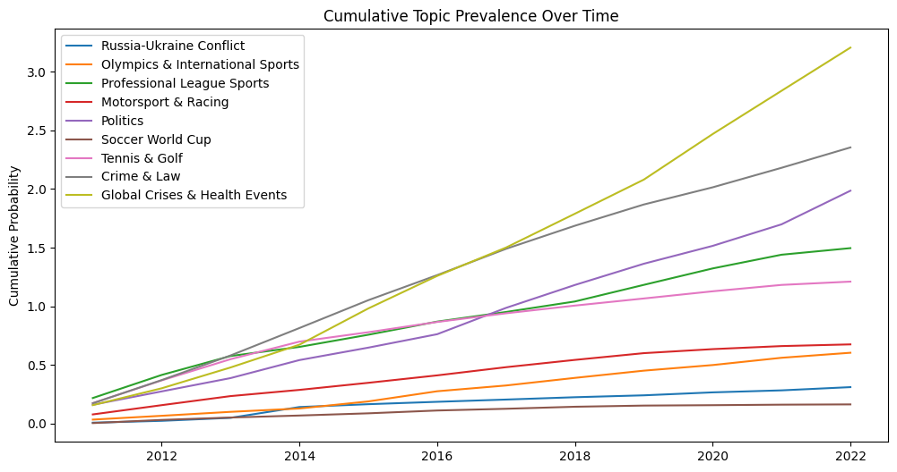

# CNN News Topic Modeling with LDA

A comprehensive topic modeling analysis of CNN news articles (2011-2022) using Latent Dirichlet Allocation (LDA) to uncover dominant themes and track their evolution over time.

## Project Overview

This project analyzes 37,940 CNN news articles spanning from 2011 to 2022 to identify recurring topics and understand how news coverage shifted in response to major world events. Using Natural Language Processing (NLP) techniques and LDA topic modeling, the analysis reveals 9 distinct topics ranging from sports coverage to global crises, with temporal trends that align remarkably well with real-world events.

## Key Findings

The analysis identified **9 major topics** in CNN's news coverage:

1. **Russia-Ukraine Conflict** - Coverage spiked dramatically in 2022
2. **Olympics & International Sports** - Periodic peaks during Olympic years
3. **Professional League Sports** - Consistent coverage of major leagues
4. **Motorsport & Racing** - Steady niche coverage
5. **Politics** - Baseline coverage with election year spikes
6. **Soccer World Cup** - Quadrennial spikes (2014, 2018, 2022)
7. **Tennis & Golf** - Regular sporting event coverage
8. **Crime & Law** - Steady coverage throughout the period
9. **Global Crises & Health Events** - Major spike during 2020-2021 COVID-19 pandemic

## Dataset

**Source**: [CNN Articles After Basic Cleaning](https://www.kaggle.com/datasets/hadasu92/cnn-articles-after-basic-cleaning) (Kaggle)

**Details**:
- **Total Articles**: 37,940 news articles
- **Time Period**: 2011 to 2022
- **Features Used**: Article text, publication date
- **Data Quality**: Pre-cleaned dataset with non-empty articles only

## Technology Stack

- **Python 3.x**
- **Natural Language Processing**: NLTK (tokenization, stopwords, lemmatization)
- **Topic Modeling**: Gensim (LDA, Coherence Model)
- **Data Processing**: Pandas, NumPy
- **Visualization**: Matplotlib, Seaborn
- **Data Source**: KaggleHub

## Data Preprocessing Pipeline

### 1. Data Cleaning
- Removed null/empty articles
- Extracted relevant columns (date, article text)
- Converted dates to datetime format and extracted year
- Sorted articles chronologically

### 2. Text Preprocessing
The preprocessing function applied the following transformations:

```python
def preprocess(doc):
    1. Lowercase conversion
    2. Remove non-alphabetic characters (keep only letters and spaces)
    3. Remove extra whitespace
    4. Tokenization using NLTK
    5. Remove stopwords (standard English + custom: 'said', 'cnn', 'according', 'told', 'also', 'say', 'like')
    6. Filter tokens (alphabetic only, length > 2)
    7. Lemmatization using WordNetLemmatizer
```

### 3. Document Representation
- Created Gensim dictionary from tokenized documents
- Converted documents to bag-of-words (BoW) corpus representation
- **Final Dictionary Size**: 287,413 unique terms

## Model Development

### LDA Model Selection

**Coherence Score Optimization**:
- Tested topic numbers from 2 to 15
- Evaluated using C_v coherence metric
- **Optimal number of topics**: 9 (highest coherence score)

### Model Parameters
```python
LdaModel(
    corpus=corpus,
    num_topics=9,
    id2word=dictionary,
    random_state=42,
    passes=10,
    alpha='auto',
    per_word_topics=True
)
```

## Visualizations & Analysis

### 1. Coherence Score Plot
**Purpose**: Determines optimal number of topics for LDA model

**Interpretation**: Shows how model coherence varies with different topic counts. The peak at 9 topics indicates this configuration produces the most semantically coherent and distinct topics.

---

### 2. Top Words per Topic (Bar Charts)
**Purpose**: Visualizes the most probable words for each discovered topic

**What it shows**: 
- Each topic represented by its top 20 most influential words
- Word probabilities indicate relative importance within the topic
- Helps interpret and label each topic meaningfully

**Example interpretations**:
- **Topic 0** (Russia-Ukraine): Keywords like "russia", "ukraine", "putin", "military"
- **Topic 8** (Global Crises): Keywords like "health", "virus", "pandemic", "case", "death"

---

### 3. Document Distribution Across Topics
**Purpose**: Shows how many articles belong to each topic

**Interpretation**: Reveals the overall prevalence of different topics in CNN's coverage. Sports-related topics (Olympics, Professional Leagues, Soccer) collectively dominate, while crisis coverage forms significant but event-driven spikes.

---

### 4. Topic Prevalence Over Time (Line Plot)
**Purpose**: Tracks how topic prominence changes year by year


**Real-world event correlation**:

#### **Russia-Ukraine Conflict** (Topic 0)
- **Peaks**: 2014, 2022
- **Real Event**: 2014 meant the first major event, where Russia annexed the Crimean Peninsula and the War in Donbas began, driving initial interest. The trend expands in 2022 with the large-scale invasion

#### **Olympics & International Sports** (Topic 1)
- **Peaks**: 2012 (London), 2016 (Rio), 2018 (PyeongChang Winter), 2021 (Tokyo, delayed from 2020)
- **Real Events**: Olympic Games cycle every 2 years (alternating Summer/Winter)

#### **Professional League Sports** (Topic 2)
- **Trend**: Consistent, steady coverage
- **Real Events**: Ongoing coverage of NBA, NFL, MLB, NHL regular seasons and playoffs

#### **Motorsport & Racing** (Topic 3)
- **Trend**: Consistent, steady coverage
- **Real Events**: The significant increase from ~2017 to 2020 is largely driven by the explosion of Formula 1 popularity globally.

#### **Politics** (Topic 4)
- **Elevated Coverage**: 2016, 2020
- **Real Events**: Trump vs Clinton 2016, Biden vs Trump 2020, 2021 Capitol Attack
- **Baseline**: Steady political coverage maintained throughout all years

#### **Soccer World Cup** (Topic 5)
- **Peaks**: 2014 (Brazil), 2018 (Russia), 2022 (Qatar)
- **Real Events**: FIFA World Cup quadrennial cycle, one of the world's most-watched sporting events

#### **Tennis & Golf** (Topic 6)
- **Trend**: High 2012-2015 then downward trend.
- **Real Events**: The early years of this chart (2011-2015) were near the peak of the iconic "Big Three" era in men's tennis: Roger Federer, Rafael Nadal, and Novak Djokovic
The decline also reflects a growing difficulty for individual, non-team sports to hold attention against other sports. 

#### **Crime & Law** (Topic 7)
- Almost non-existent

#### **Global Crises & Health Events** (Topic 8)
- **Major Spikes**: 2014-2016, 2020-2021
- **Real Event**: 2014 Ebola Outbreak, 2020-2021 COVID-19 Pandemic.
- **Additional Context**: Includes natural disasters, epidemics, and humanitarian crises.

---

### 5. Topic Prevalence Heatmap
**Purpose**: Provides a dense, color-coded view of topic intensity across years


**Color Interpretation**:
- **Darker colors** = Higher topic prevalence in that year
- **Lighter colors** = Lower topic prevalence

**Key Observations**:
- **2022**: Darkest cell for Russia-Ukraine topic (0.11-0.13 probability)
- **2020-2021**: Strong coloring for Global Crises topic (pandemic period)
- **Olympic years**: Noticeable color intensity in Topic 1 rows
- **World Cup years**: Distinct pattern every 4 years in Topic 5

---

### 6. Cumulative Topic Prevalence
**Purpose**: Shows accumulated topic presence over time (stacked area representation)


**Interpretation**: 
- Reveals long-term trends in coverage allocation
- Shows how CNN's editorial focus shifted over the decade
- Sports coverage remains consistently prominent
- Crisis-driven topics (COVID, Ukraine) create visible inflection points
- Demonstrates editorial bandwidth reallocation during major events

**Real-world insight**: During major crises (2020-2021 pandemic, 2022 Ukraine war), other topics received proportionally less coverage, showing how breaking news reshapes media priorities.

---

## Getting Started

### Running the Analysis

1. **Clone the repository**
```bash
git clone https://github.com/yourusername/cnn-topic-modeling.git
cd cnn-topic-modeling
```

2. **Install dependencies**
```bash
pip install -r requirements.txt
```

3. **Run the Jupyter notebook**
```bash
jupyter notebook topic_modeling.ipynb
```

4. **Dataset will automatically download** via KaggleHub.

---

### 📬 Contact

🔗 [LinkedIn](https://www.linkedin.com/in/vidhi-parmar1/) | [Email](vidhi30th@gmail.com) 